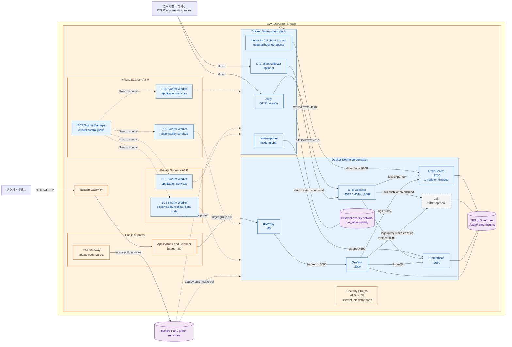

# Architecture diagrams

이 문서는 현재 저장소의 Docker Swarm 구성을 기준으로 작성한 Mermaid 다이어그램입니다.

- 기본 서버 스택: OpenSearch, Grafana, HAProxy, Prometheus, OTel Collector
- 선택 서버 스택: Loki
- 클라이언트 스택: Alloy, node-exporter, OTel Collector, Fluent Bit, Filebeat, Vector 중 선택
- `ovs_observability`는 서버 스택과 클라이언트 스택이 공유하는 외부 Docker overlay network입니다.

## AWS 플랫폼 대응 구성도

이 프로젝트는 Docker Swarm stack 파일을 생성하므로 AWS에서는 ECS/Fargate로 변환하기보다 EC2 기반 Docker Swarm 클러스터에 배치하는 것이 현재 코드와 가장 직접적으로 대응됩니다. 아래의 AWS 리소스는 배포 대상이며, 이 저장소가 직접 생성하지는 않습니다.



### 구성 해석

- 외부 진입점은 ALB이고, ALB target group은 Docker Swarm 노드의 HAProxy `:80`으로 연결합니다. HAProxy는 코드상 Grafana `:3000`으로 라우팅합니다.
- Swarm manager와 worker는 EC2에 배치하며, 관측 스택은 별도 worker 노드에 고정하는 것을 권장합니다. OpenSearch 다중 노드는 AZ를 분산합니다.
- ALB는 외부 `:80` 또는 HTTPS 종료 지점으로 사용하고, Security Group에서는 ALB → HAProxy `:80`, 클라이언트 → 중앙 OTel `:4317/:4318`, Prometheus → exporter 포트만 허용합니다.
- 앱의 OTLP 텔레메트리는 Alloy 또는 클라이언트 OTel Collector를 거쳐 중앙 OTel Collector로 전달됩니다.
- 호스트 로그 수집기는 현재 템플릿 기준 OpenSearch로 직접 전송합니다.
- Prometheus는 OTel Collector의 `:8889`와 node-exporter를 scrape합니다. 기본 설정은 node-exporter 주소를 정적으로 가집니다.
- `./data/*` bind mount는 EC2의 EBS 볼륨에 연결합니다. 현재 코드에는 S3, Amazon Managed Service for Prometheus, Amazon OpenSearch Service, ECS/Fargate를 사용하는 경로가 없습니다.
- Private Subnet의 EC2가 Docker Hub 등에서 이미지를 받아야 하므로 NAT Gateway 또는 VPC 내부 registry(ECR로 이미지 이전 시 VPC endpoint)를 고려합니다.

## UML 컴포넌트 다이어그램

이 프로젝트는 런타임 객체보다 `Makefile → TypeScript generator → Handlebars template → Docker Swarm stack`의 생성 구조와 관측 데이터 흐름이 핵심이므로 컴포넌트 다이어그램이 가장 적합합니다.

```mermaid
classDiagram
    direction LR

    class Makefile {
      <<component>>
      +stack()
      +clientStack()
      +deploy()
      +status()
      +logs()
    }

    class EnvironmentConfig {
      <<configuration>>
      STACK_NAME
      ENABLE_OPENSEARCH
      ENABLE_LOKI
      ENABLE_CLIENT_OPTIONS
      ENDPOINT_OPTIONS
    }

    class StackGenerator {
      <<component>>
      +parseBoolean()
      +parsePositiveInteger()
      +resolveOpenSearchImageTag()
      +renderStack()
    }

    class ClientStackGenerator {
      <<component>>
      +parseHttpEndpoint()
      +renderClientStack()
    }

    class ServerTemplates {
      <<template set>>
      stack_template
      otel_collector_template
      prometheus_template
      grafana_datasource_template
      haproxy_template
    }

    class ClientTemplates {
      <<template set>>
      client_stack_template
      alloy_config_template
      otel_client_template
      fluent_bit_template
      filebeat_template
      vector_template
    }

    class ServerStack {
      <<Docker Swarm stack>>
      haproxy_service
      grafana_service
      prometheus_service
      otel_collector_service
      opensearch_or_loki_service
    }

    class ClientStack {
      <<Docker Swarm stack>>
      alloy_service
      node_exporter_service
      otel_client_service
      optional_log_agent_services
    }

    class OTelPipeline {
      <<runtime component>>
      +receive_otlp()
      +batch_and_limit()
      +export_logs()
      +export_metrics()
    }

    class StorageBackends {
      <<runtime component>>
      opensearch_logs_index
      loki_log_store
      prometheus_tsdb
    }

    class Grafana {
      <<runtime component>>
      prometheus_datasource
      opensearch_datasource
      loki_datasource
      provisioned_dashboards
    }

    Makefile --> EnvironmentConfig : loads mk/*.mk and .env
    Makefile --> StackGenerator : npm run generate:stack
    Makefile --> ClientStackGenerator : npm run generate:client-stack
    StackGenerator --> ServerTemplates : Handlebars render
    ClientStackGenerator --> ClientTemplates : Handlebars render
    StackGenerator --> ServerStack : generates deploy/stack.yml
    ClientStackGenerator --> ClientStack : generates deploy/stack.client.yml
    ServerStack --> OTelPipeline : runs
    ClientStack --> OTelPipeline : OTLP upstream
    OTelPipeline --> StorageBackends : logs / metrics
    Grafana --> StorageBackends : queries
    ServerStack --> Grafana : HAProxy routes HTTP
    ClientStack --> StorageBackends : direct host-log path
```

선택 기능을 모두 켜지 않아도 생성기는 동작하며, `ENABLE_OPENSEARCH`와 `ENABLE_LOKI` 중 하나 이상은 켜야 합니다. `Fluent Bit`, `Filebeat`, `Vector`는 현재 템플릿상 OpenSearch 직접 전송 경로를 사용하므로 Loki-only 구성에는 적합하지 않습니다.
